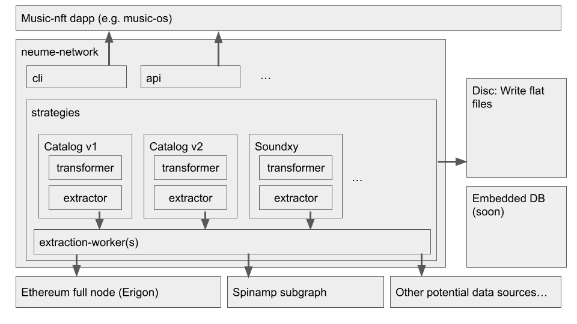

# neume-network architecture

## Purpose

The purpose of this document is to describe the architecture of the
neume-network such that it can be effectively communicated to contributors.

## Component Structure

The neume-network is currently set up as a collection of individual npm
packages. At the core is neume-network/core that imports
neume-network/strategies as a git submodule. All other neume-network components
are integrated through npm's package management system.

Following is a table of the network's components and their purpose:

| name              | purpose                                                                                                                                                                                                            |
| ----------------- | ------------------------------------------------------------------------------------------------------------------------------------------------------------------------------------------------------------------ |
| core              | core is the main package bundling all other components into the neume-network node software. Additionally, e.g. with environment variables, core provides guarantees about the existence of e.g. global variables. |
| strategies        | strategies is integrated using git submodules. It's purpose is to enable external contributors to easily write indexing strategies given a usable interface definition.                                            |
| schema            | schema defines a normalized music NFT JSON schema.                                                                                                                                                                 |
| message-schema    | message-schema defines an internal messaging schema that neume-network components can rely on to establish inter-connectivity.                                                                                     |
| extraction-worker | extraction-worker is a throughput-optimized node worker that allows efficient extraction of external information (e.g. from web APIs).                                                                             |
| data              | data is a temporary repository containing a data set from an earlier version of the neume network.                                                                                                                 |

### Missing Future Components

Currently, there are a couple of neume-network components we anticipate needing
in the future. Below is a non-exhaustive list:

| name | purpose                                                                                                                                                                                               |
| ---- | ----------------------------------------------------------------------------------------------------------------------------------------------------------------------------------------------------- |
| api  | api provisions an external REST, graphql, or RPC API to users running a neume-network node. It allows to request the indexed data. For now, the api component is polyfilled with the data repository. |
| cli  | The cli component allows users to configure the neume-network node when running it in their shell.                                                                                                    |
| p2p  | p2p is the network portion of neume. It enables interconnectivity between neume nodes as to e.g. improve indexing speed or media blob provision.                                                      |

### Visual Overview

Below is a visual overview of the above components and how they interact with
miscellaneous software like an Ethereum full node.

## Strategies Lifecycle Pattern

For details see
[neume-network/strategies/readme.md](https://github.com/neume-network/strategies#implementing-new-strategies).
